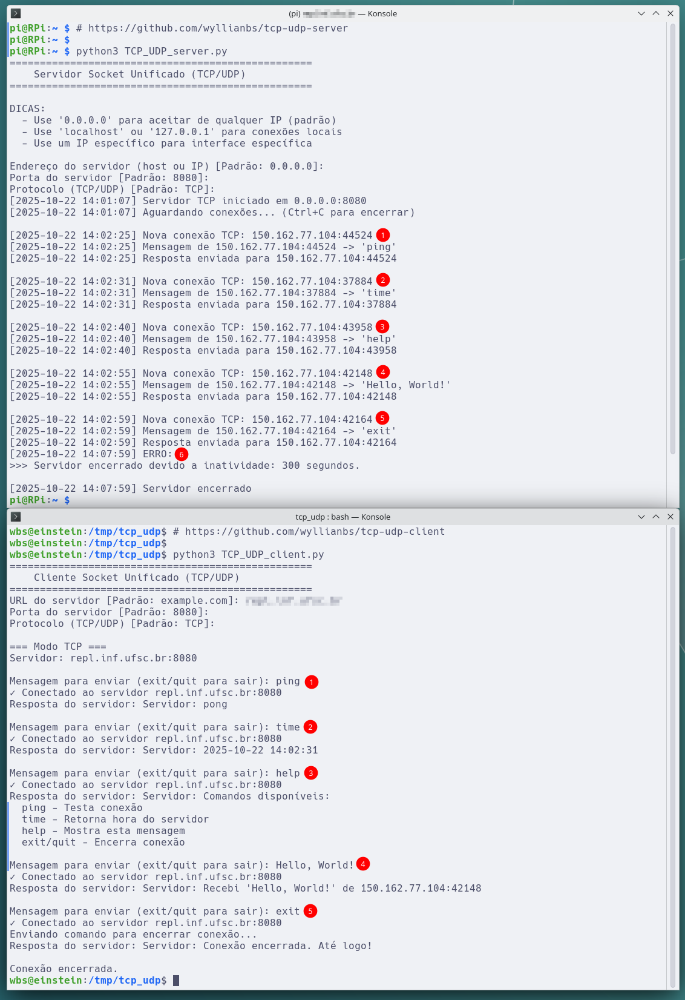

# 🌐 Cliente Socket Unificado (TCP/UDP)

Um cliente de socket educacional implementado em Python com suporte para protocolos TCP e UDP, utilizando Programação Orientada a Objetos (POO) e Type Hints.

## 📋 Descrição

Este código em Python 3 implementa um cliente de socket genérico que pode conectar a servidores TCP ou UDP. Foi desenvolvido com fins educacionais para demonstrar conceitos de programação de redes, padrões de projeto e comunicação cliente-servidor.

### ✨ Características Principais

- 🔄 **Suporte duplo**: Conecta a servidores TCP ou UDP.
- 🏗️ **Arquitetura orientada a objetos**: Uso de classes abstratas e padrão Factory.
- 📝 **Type Hints**: Código totalmente tipado para melhor documentação.
- ⏱️ **Timeout automático**: Encerra após 2 minutos de inatividade.
- 🔗 **Parser de URL**: Suporta múltiplos formatos de URL.
- 💬 **Interface interativa**: Loop de mensagens para comunicação contínua.
- 🎯 **Comandos especiais**: ping, time, help, exit/quit.


## 📚 Recursos Educacionais

Este projeto demonstra:

### Conceitos de Redes
- ✅ **Sockets Berkeley**: API padrão para programação de rede.
- ✅ **TCP three-way handshake**: SYN, SYN-ACK, ACK.
- ✅ **UDP datagram**: Comunicação sem conexão.
- ✅ **Client-Server model**: Arquitetura de comunicação.
- ✅ **Blocking I/O**: Operações que bloqueiam até completar.

### Conceitos de Programação
- ✅ **Programação Orientada a Objetos**: Classes, herança, polimorfismo.
- ✅ **Classes Abstratas**: ABC e métodos abstratos.
- ✅ **Type Hints**: Anotações de tipo para Python.
- ✅ **Padrões de Projeto**: Factory, Template Method, Strategy.
- ✅ **Tratamento de Exceções**: try-except-finally.
- ✅ **Context Managers**: Gerenciamento de recursos.

### Boas Práticas
- ✅ **DRY**: Don't Repeat Yourself.
- ✅ **SOLID**: Princípios de design orientado a objetos.
- ✅ **Clean Code**: Código legível e manutenível.
- ✅ **Documentação**: Docstrings e comentários.
- ✅ **Error Handling**: Tratamento robusto de erros.


## 🚀 Funcionalidades

### Comportamento por Protocolo

#### TCP (Transmission Control Protocol)
- ✓ Cria **nova conexão para cada mensagem** (stateless).
- ✓ Estabelece conexão antes de enviar dados (three-way handshake).
- ✓ Garante entrega e ordem das mensagens.
- ✓ Mais confiável, porém com maior overhead.
- ✓ Fecha conexão após cada envio/recepção.

**Fluxo TCP:**
```
1. Usuário digita mensagem.
2. Cliente cria socket.
3. Cliente conecta ao servidor.
4. Cliente envia mensagem.
5. Cliente recebe resposta.
6. Cliente fecha conexão.
7. Repete para próxima mensagem.
```

#### UDP (User Datagram Protocol)
- ✓ Mantém **socket aberto durante toda a sessão** (stateful).
- ✓ Não estabelece conexão (connectionless).
- ✓ Não garante entrega ou ordem.
- ✓ Mais rápido e com menor overhead.
- ✓ Ideal para aplicações em tempo real.

**Fluxo UDP:**
```
1. Cliente cria socket UDP (uma vez).
2. Para cada mensagem:
   - Envia datagrama.
   - Recebe resposta.
3. Fecha socket ao encerrar.
```

### Comandos Disponíveis

Após conectar ao servidor, você pode enviar:

| Comando | Descrição |
|---------|-----------|
| `ping` | Testa a conectividade (servidor responde "pong") |
| `time` | Solicita data/hora atual do servidor |
| `help` | Lista comandos disponíveis no servidor |
| `exit` / `quit` | Encerra a sessão |
| Qualquer texto | Enviado ao servidor como mensagem |

## 📦 Requisitos

- Python 3.6 ou superior
- Bibliotecas padrão do Python (não requer instalação adicional):
  - `socket`
  - `signal`
  - `re`
  - `urllib`
  - `typing`
  - `abc`
  - `enum`

## 🔧 Instalação

1. Clone o repositório:
```bash
git clone https://github.com/wyllianbs/tcp-udp-client.git
cd tcp-udp-client
```

2. Certifique-se de ter Python 3.6+ instalado:
```bash
python3 --version
```

3. Torne o arquivo executável (opcional):
```bash
chmod +x TCP_UDP_client.py
```

## 💻 Uso

### Iniciando o Cliente

Execute o script:
```bash
python3 TCP_UDP_client.py
```

O cliente solicitará as seguintes informações:

1. **URL do servidor** (padrão: `example.com`):
   - Formatos aceitos:
     - `localhost`.
     - `192.168.1.10`.
     - `example.com`.
     - `example.com:9000`.
     - `http://example.com`.
     - `tcp://example.com:8080`.

2. **Porta** (padrão: `8080`):
   - Valores válidos: 1-65535.
   - Se especificada na URL, a porta da URL prevalece.

3. **Protocolo** (padrão: `TCP`):
   - `TCP` - Para conexões confiáveis.
   - `UDP` - Para comunicação sem conexão.

### Exemplo de Uso Completo

#### Conectando via TCP
```bash
$ python3 TCP_UDP_client.py

==================================================
    Cliente Socket Unificado (TCP/UDP)
==================================================
URL do servidor [Padrão: example.com]: localhost
Porta do servidor [Padrão: 8080]: 8080
Protocolo (TCP/UDP) [Padrão: TCP]: TCP

=== Modo TCP ===
Servidor: localhost:8080

✓ Conectado ao servidor localhost:8080
Mensagem para enviar (exit/quit para sair): ping
Resposta do servidor: Servidor: pong

✓ Conectado ao servidor localhost:8080
Mensagem para enviar (exit/quit para sair): time
Resposta do servidor: Servidor: 2025-10-22 14:32:10

Mensagem para enviar (exit/quit para sair): quit
Resposta do servidor: Servidor: Conexão encerrada. Até logo!

Conexão encerrada.
```

### Formatos de URL Suportados

O cliente aceita diversos formatos de URL:

| Formato | Exemplo | Host | Porta |
|---------|---------|------|-------|
| Simples | `localhost` | localhost | 8080 (padrão) |
| Com porta | `localhost:9000` | localhost | 9000 |
| IP | `192.168.1.10` | 192.168.1.10 | 8080 (padrão) |
| IP com porta | `192.168.1.10:7000` | 192.168.1.10 | 7000 |
| Com protocolo | `http://example.com` | example.com | 8080 (padrão) |
| Completo | `tcp://example.com:8080` | example.com | 8080 |


## 📊 Exemplo



Em (6), após 5 minutos (300 s) de inatividade, o server encerra a escuta. Caso, seja digitado Ctrl+C o server também é encerrado.


## 🏗️ Arquitetura

O projeto utiliza os seguintes padrões de projeto e conceitos:

### Padrões de Projeto

- **Factory Pattern**: `ClientFactory` cria instâncias apropriadas de cliente.
- **Template Method**: `SocketClient` define estrutura comum, subclasses implementam detalhes.
- **Strategy Pattern**: Diferentes estratégias de comunicação (TCP/UDP).

### Estrutura de Classes

```
ClientApplication
    └── ClientFactory
        ├── TCPClient (extends SocketClient)
        │   ├── Conecta para cada mensagem
        │   └── Fecha após cada operação
        └── UDPClient (extends SocketClient)
            ├── Mantém socket aberto
            └── Sem conexão estabelecida
    ├── URLParser
    └── TimeoutHandler
```

### Componentes Principais

- **`SocketClient`**: Classe abstrata base para clientes.
- **`TCPClient`**: Implementação do cliente TCP (stateless).
- **`UDPClient`**: Implementação do cliente UDP (stateful).
- **`ClientFactory`**: Factory para criar clientes.
- **`URLParser`**: Processa e extrai informações de URLs.
- **`TimeoutHandler`**: Gerencia timeout de inatividade.
- **`Protocol`**: Enum para protocolos disponíveis.
- **`ClientApplication`**: Aplicação principal.

### Diagrama de Fluxo

```
┌─────────────────────┐
│ ClientApplication   │
└──────────┬──────────┘
           │ get_user_input()
           ▼
┌─────────────────────┐
│ URLParser           │
│ - extract_host_port │
└──────────┬──────────┘
           │
           ▼
┌─────────────────────┐
│ ClientFactory       │
│ - create_client()   │
└──────────┬──────────┘
           │
    ┌──────┴──────┐
    ▼             ▼
┌─────────┐  ┌─────────┐
│TCPClient│  │UDPClient│
└─────────┘  └─────────┘
```

## 🔄 Comparação TCP vs UDP

### Quando usar TCP:
- ✅ Quando precisa garantir entrega de todas as mensagens.
- ✅ Quando a ordem das mensagens é importante.
- ✅ Para transferência de arquivos ou dados críticos.
- ✅ Quando confiabilidade é mais importante que velocidade.
- ✅ Aplicações web, email, transferência de arquivos.

### Quando usar UDP:
- ✅ Quando velocidade é mais importante que confiabilidade.
- ✅ Para streaming de áudio/vídeo.
- ✅ Para jogos online (onde latência baixa é crítica).
- ✅ Para broadcast/multicast.
- ✅ DNS queries, VoIP, live streaming.

### Tabela Comparativa

| Característica | TCP | UDP |
|----------------|-----|-----|
| **Conexão** | Orientado a conexão | Sem conexão |
| **Confiabilidade** | Confiável (ACK/retransmissão) | Não confiável |
| **Ordem** | Garante ordem | Não garante ordem |
| **Velocidade** | Mais lento (overhead) | Mais rápido |
| **Overhead** | Alto | Baixo |
| **Uso de recursos** | Maior | Menor |
| **Detecção de erros** | Sim | Básica (checksum) |
| **Controle de fluxo** | Sim | Não |
| **Estado da conexão** | Mantém estado | Stateless |

## 🧪 Testes

### Testando com Servidor de Exemplo

Primeiro, inicie o servidor (se você tiver o `TCP_UDP_server.py`):
```bash
# Terminal 1
python3 TCP_UDP_server.py
Endereço: 0.0.0.0
Porta: 8080
Protocolo: TCP
```

Depois, execute o cliente:
```bash
# Terminal 2
python3 TCP_UDP_client.py
URL: localhost
Porta: 8080
Protocolo: TCP
```

### Teste de Comandos

```bash
# Teste ping
Mensagem: ping
Esperado: Servidor: pong

# Teste time
Mensagem: time
Esperado: Servidor: 2025-10-22 14:30:00

# Teste help
Mensagem: help
Esperado: Lista de comandos

# Teste eco
Mensagem: Hello
Esperado: Servidor: Recebi 'Hello' de IP:PORTA
```

### Testando com Servidores Públicos

#### Teste com servidor DNS (UDP)
```bash
# Nota: Este é apenas exemplo educacional
# Requer conhecimento de protocolo DNS
python3 TCP_UDP_client.py
URL: 8.8.8.8
Porta: 53
Protocolo: UDP
```

#### Teste com servidor web (TCP)
```bash
# Enviando requisição HTTP simples
python3 TCP_UDP_client.py
URL: example.com
Porta: 80
Protocolo: TCP

Mensagem: GET / HTTP/1.1
(aguarde resposta HTTP)
```

## 🐛 Solução de Problemas

### Erro: "Connection refused"
```
Causa: Servidor não está rodando ou porta incorreta.
Solução:
1. Verifique se o servidor está rodando.
2. Confirme host e porta corretos.
3. Verifique firewall.
```

### Erro: "Network is unreachable"
```
Causa: Problemas de rede ou host inválido.
Solução:
1. Verifique conectividade: ping HOST.
2. Confirme que o host está acessível.
3. Verifique configurações de rede.
```

### Erro: "Name or service not known"
```
Causa: Nome do host não pode ser resolvido.
Solução:
1. Verifique DNS.
2. Use IP ao invés de hostname.
3. Confirme que o hostname está correto.
```

### Timeout da aplicação
```
Causa: Inatividade por 2 minutos.
Solução:
1. Aumente timeout no código:
   TimeoutHandler(timeout=300)  # 5 minutos.
2. Ou envie mensagens mais frequentemente.
```

### UDP não recebe resposta
```
Causa: UDP não garante entrega.
Solução:
1. Verifique se servidor está configurado para UDP.
2. Confirme que servidor está respondendo.
3. Tente TCP para debugging.
```

## 🔐 Segurança

### Considerações de Segurança

⚠️ **ATENÇÃO**: Este cliente foi desenvolvido para fins educacionais:

- Não implementa autenticação.
- Não possui criptografia de dados.
- Envia dados em texto plano.
- Não valida certificados SSL/TLS.
- Vulnerável a man-in-the-middle.


## 💡 Exemplos de Uso Avançado

### Script Automático
```python
# auto_client.py
import subprocess
import sys

commands = ['ping', 'time', 'help', 'exit']

for cmd in commands:
    print(f"Enviando: {cmd}")
    # Implemente automação aqui
```

### Integração com Outros Programas
```python
# integration.py
from TCP_UDP_client import ClientFactory, Protocol, TimeoutHandler

timeout = TimeoutHandler(timeout=60)
client = ClientFactory.create_client(
    Protocol.TCP,
    'localhost',
    8080,
    timeout
)
```


## Código Relacionado
- [Servidor Socket Unificado (TCP/UDP)](https://github.com/wyllianbs/tcp-udp-server).


## 📖 Recursos Adicionais

### Documentação Python
- [Socket Programming](https://docs.python.org/3/howto/sockets.html).
- [ABC - Abstract Base Classes](https://docs.python.org/3/library/abc.html).
- [Type Hints](https://docs.python.org/3/library/typing.html).

### RFCs Relevantes
- [RFC 793 - TCP](https://tools.ietf.org/html/rfc793).
- [RFC 768 - UDP](https://tools.ietf.org/html/rfc768).
- [RFC 1122 - Internet Host Requirements](https://tools.ietf.org/html/rfc1122).


## 📜 Licença

Este projeto está licenciado sob a Licença [GNU General Public License v3.0](LICENSE).

## 👤 Autor

**Prof. Wyllian B. da Silva**  
Departamento de Informática e Estatística (INE)  
Universidade Federal de Santa Catarina (UFSC)

---

**Nota**: Este projeto foi desenvolvido especificamente para uso na UFSC, mas pode ser facilmente adaptado para outras instituições de ensino.
